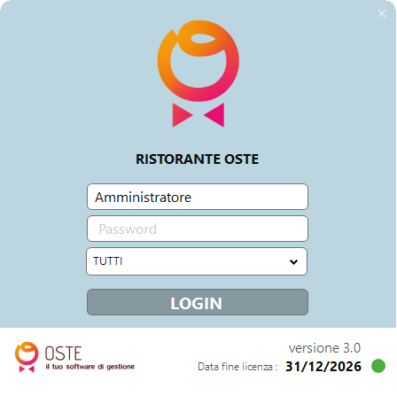

# Accesso al sistema

## Come accedere a OSTE

Per accedere al gestionale, apri OSTE dal tuo dispositivo cliccando sull’apposita icona.\
Si aprirà la schermata di login, dove saranno visibili eventuali centri di costo gestibili, la data di scadenza della licenza e la versione del software.

***

<figure><figcaption></figcaption></figure>

## La schermata di accesso

Nella pagina di login troverai due campi:

| Campo               | Cosa inserire                                        |
| ------------------- | ---------------------------------------------------- |
| **Utente**          | Il nome utente fornito                               |
| **Password**        | La password del tuo account                          |
| **Centro di Costo** | Centri di costo gestibili (qualora siano più di uno) |

Inserisci le credenziali e clicca su **LOGIN**.

***

## Cosa fare se non ricordi la password?

Contatta il tuo referente per il ripristino delle credenziali

***

## Tipi di utente

OSTE prevede diversi livelli di accesso a seconda del ruolo:

* **Amministratore** — accesso completo a tutte le funzioni, incluse statistiche e configurazioni
* **Operatore di sala** — accesso alla gestione tavoli e comande
* **Operatore di cucina**— accesso alla gestione comande elettroniche&#x20;

Le credenziali vengono configurate durante la sessione di installazione iniziale.

***

➡️ Prossimo passo: [Panoramica dell'interfaccia](interfaccia.md)
