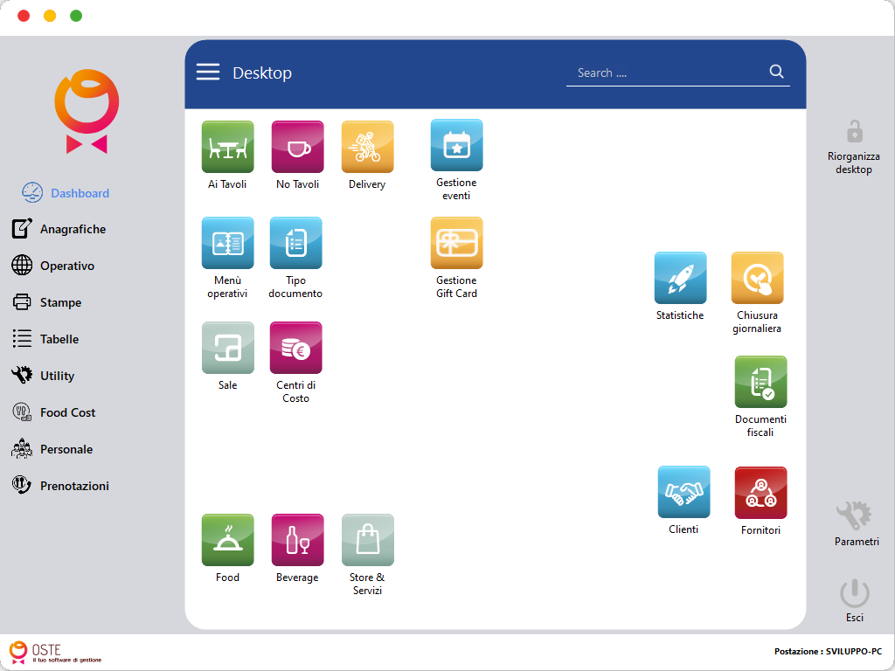

# Panoramica dell'interfaccia

## La schermata principale

Dopo aver effettuato l'accesso, ti troverai nella schermata principale di OSTE. L'interfaccia è progettata per essere semplice e veloce da usare, anche durante i momenti più frenetici del servizio.

***

<figure><figcaption></figcaption></figure>

***

### 📋 Menu laterale a destra

Sulla sinistra trovi il menu principale con accesso rapido a:

* **Anagrafiche**
* **Operativo**
* **Stampe**
* **Tabelle**
* **Utility**
* **Food Cost**
* **Personale**
* **Prenotazioni**

***

### 🔔 Barra superiore

In alto trovi:

* Il campo ricerca per richiamare direttamente una voce del menù
* Le notifiche di sistema se attivate in sezione Parametri
* Il tasto per uscire dal programma

***

### 🔔 Barra laterale sinistra

Trovi tre voci:

* Riorganizza desktop
* Parametri
* Esci dal OSTE

## Consigli per i primi utilizzi

> 💡 La prima volta che usi OSTE, prenditi qualche minuto per esplorare la mappa del menù laterale e familiarizzare con le voci presentii.&#x20;

***

➡️ Prossimo passo: [La sala virtuale](../02-tavoli/sala-virtuale.md)
